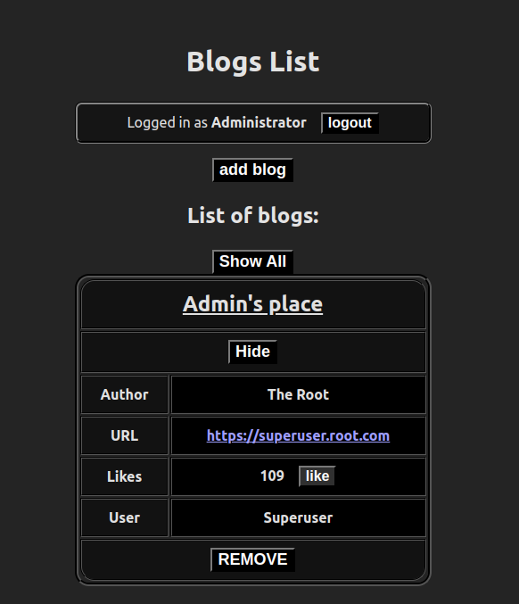
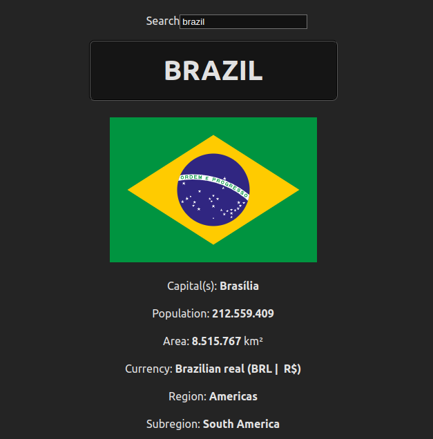

# WebApps

Web apps designed to be deployed on hosting platforms such as Render.

## Table of contents
  - [Blogs List](#blogs-list)
  - [CountriesList](#countrieslist)
  - [GPU List](#gpu-list)
  - [Notes](#notes)
  - [PhoneBook](#phonebook)
  - [User Management App](#user-management-app)


## Blogs List
### About
Single Page Application to store your personal list of blogs, you can add, remove and like the blogs from the list. The backend supports all CRUD operations, through the frontend users are able to add, like and remove blogs. An account is required to perform any operation on the app. All users have access to all blogs available on the database.



### Usage
#### Frontend
Navigate to the frontend folder and install the necessary dependencies
  ```
  cd ./blogslist/frontend && npm install
  ```

Start the frontend with
  ```
  npm run dev
  ```

On the main page, click on the Log in button and enter the following credentials
  ```
  username: root
  password: admin
  ```

The list of blogs will be displayed on the app's UI.

To add a new blog, click on the `add blog` button, enter the Title, Author and blog URL on the specified fields, in a format, for example
  ```
  Title: Admin's Place
  Author: Admin
  URL: https://superuser.root.com
  ```

All blogs will have a default of 0 likes, you can like any of them as many times as you want, the more likes, the higher the blog will displayed on the page, the default ordering method is listed by the most liked blogs from top to bottom.

To like a blog, simply click on the `show` button to display a blog's full info table and hit `like`.

#### Backend
Navigate to the backend folder and install the necessary dependencies
  ```
  cd ./blogslist/backend && npm install
  ```

Start the backend with
  * On dev mode, using nodemon for hot reloading
    ```
    npm run dev
    ```

  * On production mode, using basic Node.js to start the server
    ```
    npm start
    ```

To make any HTTP requests to the backend /blogs api, an authorization token is required

Create a new user
  ```
  POST http://localhost:3003/api/users username="admin" name="The Admin" password="admin"
  ```

Fetching the list of users
  ```
  GET http://localhost:3003/api/users
  ```

Logging in
  ```
  POST http://localhost:3003/api/login username="admin" password="admin"
  ```

Copy the authorization token, example
  ```
  {
    "name": "The Admin",
    "token": " <authorization token>",
    "username": "admin"
  }
  ```

The backend supports all CRUD operations for blogs
  * Create (The like field is obligatory when making direct server requests)
    ```
    POST http://localhost:3003/api/blogs Authorization:"Bearer  <authorization token>" title="Random Blog" author="anonymous" url="https://random-blog.com" likes=1
    ```

  * Read
    * Fetch all
      ```
      GET http://localhost:3003/api/blogs
      ```

    * Fetch a specific id
      ```
      GET http://localhost:3003/api/blogs/:id
      ```

  * Update (The backend can only update the number of likes)
    ```
    PUT http://localhost:3003/api/blogs/:id Authorization:"Bearer <authorization token>" likes=1000
    ```

  * Delete
    ```
    DELETE http://localhost:3003/api/blogs/:id
    ```


## Countries List
### About
Single Page Application to search for a specific country information. The table of data has the following information: country's flag, capital(s), population, area (in km²), currency, region (continent), subregion, borders and official languages.



### Usage
Navigate to the main folder and install the necessary dependencies
  ```
  cd ./countrieslist/ && npm install
  ```

Start the app with
  ```
  npm run dev
  ```

The app does not have a separate backend to fetch data through HTTP requests, all data is fetched directly through the frontend using axios.


## GPU List
### About
Single Page Application to store all of your GPUs data, including the main chip specifications: Cores, TMUs, ROPs, VRAM, Bus Width; The clock speeds: Base Clock, Boost Clock, Memory Clock (Frequency); The app will automatically calculate the theoretical performance of the card: FP32(float), Texture Rate, Pixel Rate and Memory Bandwidth. The frontend UI supports adding, deleting and searching specific GPUs.

* Main UI

  

* Alternate UI (Beta version)

  

### Usage
#### Frontend
You can only start one of the frontends at a time, in case you choose both, on will run on port `:5173` and the other on `:5174`.

Navigate to the main UI folder and install the necessary dependencies
  ```
  cd ./gpulist/client && npm install
  ```

Start the frontend with
  ```
  npm run dev
  ```

OPTIONAL: Start the alternate UI
  ```
  cd ./gpulist/alternate-client && npm install && npm run dev
  ```

#### Backend


## Notes
### About


### Usage


## PhoneBook
### About


### Usage


## User Management App
### About


### Usage


