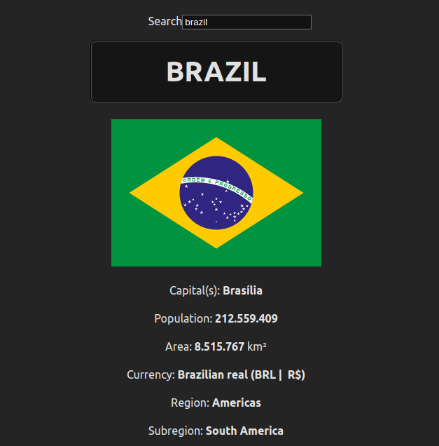

# Countries List
## About
Single Page Application to search for a specific country information. The table of data has the following information: country's flag, capital(s), population, area (in km²), currency, region (continent), subregion, borders and official languages.



## Usage
Navigate to the main folder and install the necessary dependencies
  ```
  cd ./countrieslist/ && npm install
  ```

Start the app with
  ```
  npm run dev
  ```

The app does not have a separate backend to fetch data through HTTP requests, all data is fetched directly through the frontend using axios.
