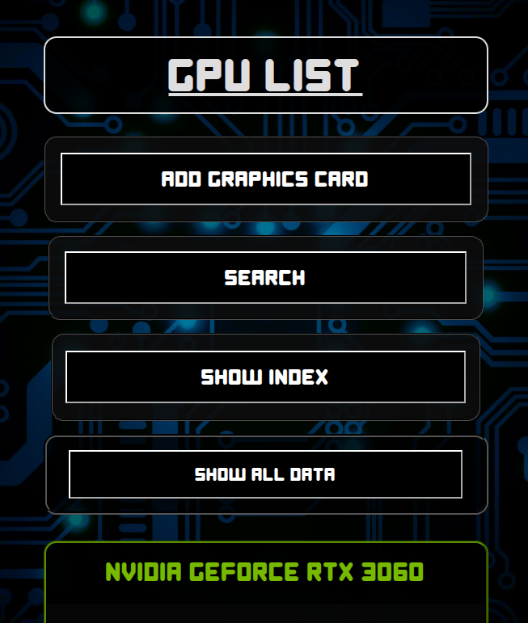

# GPU List
## Table of contents
  - [About](#about)
  - [Starting the web app](#starting-the-web-app)
    - [Frontend](#frontend)
    - [Backend](#backend)
  - [Navigating the UI](#navigating-the-ui)
    - [Main UI](#main-ui)
      - [Displaying a graphics card data](#displaying-a-graphics-card-data)
      - [Adding a new graphics card](#adding-a-new-graphics-card)
      - [Using the search functionality](#using-the-search-functionality)
      - [Using the index](#using-the-index)
      - [Removing a graphics card from the list](#removing-a-graphics-card-from-the-list)
    - [Alternative UI](#alternative-ui)
      - [Displaying a graphics card data](#displaying-a-graphics-card-data-1)
      - [Adding a new graphics card](#adding-a-new-graphics-card-1)
      - [Using the search functionality](#using-the-search-functionality-1)
      - [Removing a graphics card from the list](#removing-a-graphics-card-from-the-list-1)
  - [Performing CRUD operations on graphics cards through the backend server](#performing-crud-operations-on-graphics-cards-through-the-backend-server)
  - [Running the web app with Docker](#running-the-web-app-with-docker)
  - [E2E testing](#e2e-testing)
    - [Manual testing](#manual-testing)
    - [Testing through Docker containers](#testing-through-docker-containers)
  - [Explaning the backend server web app structure](#explaning-the-backend-server-web-app-structure)

## About
Single Page Application to store all of your graphics cards data, including the main chip specifications: Cores, TMUs, ROPs, VRAM, Bus Width; The clock speeds: Base Clock, Boost Clock, Memory Clock (Frequency); The web app will automatically calculate the theoretical performance of the card: FP32(float), Texture Rate, Pixel Rate and Memory Bandwidth. The frontend UI supports adding, deleting and searching specific cards. This web app uses a MongoDB database, implementing mongoose+express on the server and axios on the client.

* Main UI

  

* Alternative UI (Beta version)

  

## Starting the web app
### Frontend
You can only start one of the frontends at a time, in case you choose both, on will run on port `:5173` and the other on `:5174`.

Navigate to the main UI folder and install the necessary dependencies
  ```
  cd ./gpulist/client && npm install
  ```

Start the frontend with
  ```
  npm run dev
  ```

OPTIONAL: Start the alternative UI
  ```
  cd ./gpulist/alternate-client && npm install && npm run dev
  ```

### Backend
Navigate to the backend folder and install the necessary dependencies
  ```
  cd ./gpulist/server && npm install
  ```

Start the backend with
  * On dev mode, using nodemon for hot reloading
    ```
    npm run dev
    ```

  * The production mode uses a static build of the frontend UI
    * First, build the frontend
      ```
      Main UI
      cd ./gpulist/client && npm run build && cp -r ./dist ../server

      OR

      Alternative UI
      cd ./gpulist/alternate-client && npm run build && cp -r ./dist ../server
      ```

    * Then start the server in production mode
      ```
      npm run start
      ```

    * The frontend will be accessible on the same address as the server http://localhost:3001


## Navigating the UI
### Main UI
#### Displaying a graphics card data
You can display each card data individually by clicking on the respective `Show` button or by clicking the `Show all data` button to expand all tables on the page.

#### Adding a new graphics card
Click on the `Add Graphics Card` button and enter the following card data: Manufacturer, GPU Line, Model, Cores, TMUs, ROPs, VRAM (in GB), Bus Width (in bits), Memory Type, Base Clock (in MHz), Boost Clock (in Mhz), Memory Clock (in Gbps). All fields are mandatory and cannot be empty. The placeholder values already have examples of what type of format the data should be added to each field.

#### Using the search functionality
Click the `Search` button, inside the input field, type any part of the full graphics card name, you can search by manufacturer, the graphics card line or by the model name itself. To search for a specific card series, simply type the first part of it, example: `rtx 40` to list all RTX 40 Series cards available on the list. The index will adapt to your search, listing only the cards that matched your keywords.

#### Using the index
Click on the `Show index` button, a scrollable display will be shown, listing all available cards on the list, by clicking on one of them, the page will automatically scroll to the table's location. If the `Show all data` button hasn't been clicked, the index will automatically expand the graphics card data table to display the information. To return to the index, press the `Back to Index` button, this will automatically close the card's data table for you.

#### Removing a graphics card from the list
Click on the `Show` button of your target graphics card, when the data table expands, scroll to the bottom of it, you will see a `Delete` button, after pressing it, the page will prompt you to confirm if you want to proceed, then the card will be removed from both the page and index.

### Alternative UI
#### Displaying a graphics card data
To display a card's data, click the `View details` button on it's respective table. The data will be displayed on a full page sized table.

#### Adding a new graphics card
Click on the `Add GPU` button and repeat the same steps from the Main UI.

#### Using the search functionality
Type your desired search keywords on the `Search GPUs` bar, the page will automatically filter out any cards that do not fit your keywords

#### Removing a graphics card from the list
Click on the `Show` button of your target graphics card, when the data table expands, scroll to the bottom of it, you will see a `Delete` button, after pressing it, the page will prompt you to confirm if you want to proceed, then the card will be removed from both the page and index.


## Performing CRUD operations on graphics cards through the backend server
Create (example)
  ```
  POST http://localhost:3001/api/gpus manufacturer="NVIDIA" gpuline="GeForce" model="RTX 5090" cores=21760 tmus=680 rops=176 vram=32 bus=512 memtype="GDDR7" baseclock=2017 boostclock=2407 memclock=28
  ```

Read
  * Fetch all graphics cards
    ```
    GET http://localhost:3001/api/gpus
    ```

  * Fetch a specific card
    ```
    GET http://localhost:3001/api/gpus/:id
    ```

Update
  * You can update any number of fields through each request
    ```
    PUT http://localhost:3001/api/gpus/:id model="RTX 4090" cores=16384 vram=24
    ```

  * Example response
    ```
    {
      "baseclock": 2017,
      "boostclock": 2407,
      "bus": 512,
      "cores": 16384,
      "gpuline": "GeForce",
      "manufacturer": "NVIDIA",
      "memclock": 28,
      "memtype": "GDDR7",
      "model": "RTX 4090",
      "rops": 176,
      "tmus": 680,
      "vram": 24
    }
    ```

Delete
  ```
  DELETE http://localhost:3001/api/gpus/:id
  ```

## Running the web app with Docker
### Docker Composer
Navigate to the `/gpulist` folder and run Docker Composer
  ```
  docker-compose up -d
  ```

### Docker containers
Create a custom network on Docker
  ```
  docker network create gpulist_webapp-network
  ```

#### Building the images	
Build images for the Main UI, Alternative UI and Backend Server
  * on ./client:
    ```
    docker build -t gpulist-webapp-client .
    ```

  * on ./alternate-client:
    ```
    docker build -t gpulist-webapp-alt-client .
    ```

  * on ./server:
    ```
    docker build -t gpulist-webapp-server .
    ```

#### Starting the containers
  * Main UI
    ```
    docker run -d --name gpulist-webapp-client --network gpulist_webapp-network -p 5173:80 gpulist-webapp-client
    ```
    
  * Alternative UI
    ```
    docker run -d --name gpulist-webapp-alt-client --network gpulist_webapp-network -p 5174:80 gpulist-webapp-alt-client
    ```

  * Server
    ```
    docker run -d --env-file .env --name gpulist-webapp-server --network gpulist_webapp-network -p 3001:3001 -ti gpulist-webapp-server
    ```

#### Running the app
  * Make HTTP requests to the backend server through http://localhost:3001/api/gpus

	* Main UI: http://localhost:5173
      
	* Alternative UI: http://localhost:5174


## E2E Testing
To run End-to-End tests with Cypress, you can either do it by running Cypress manually through the CLI, or by using Docker Compose to set a multi container orchestration for running tests. The backend will connect to a test database in MongoDB, to prevent any data losses from the main database during the tests.

`!Warning!` the E2E tests were designed to work with the Main UI only

### Manual testing
Navigate to the `tests` folder and install the dependencies
  ```
  cd ./tests && npm install
  ```

Start the Main UI
  ```
  cd ./client && npm run dev
  ```

Start the Backend Server is testing mode
  ```
  cd ./server && npm run start:test
  ```

Starting Cypress in UI mode
  ```
  npm run cypress:open
  ```

Starting Cypress in command line mode:
  ```
  npm run cypress:cline
  ```
  
### Testing through Docker containers
Run the Docker Compose file
  ```
  docker compose -f docker-compose.test.yml up --build --abort-on-container-exit
  ```


## Explaning the backend server web app structure
### Folder structure
  ```
  gpuList-web-app/
  ├── index.js             # Entry point of the application
  ├── app.js               # Main Express app setup
  ├── dist/                # Compiled/production-ready files (if applicable)
  │   └── ...
  ├── controllers/         # Handles request logic (Controllers)
  │   └── gpus.js          # GPUs controller: handles API requests related to the GPUs
  ├── models/              # Data models/schema definitions (Models)
  │   └── gpu.js           # Defines the GPU schema/model
  ├── package-lock.json    # Manages exact dependency versions
  ├── package.json         # Project dependencies and scripts
  ├── utils/               # Utility/helper functions
  │   ├── config.js        # Handles environment configurations
  │   ├── logger.js        # Logger setup (for logging requests/errors)
  │   └── middleware.js    # Custom middleware (e.g., authentication, error handling)
  ```

### How Everything Works Together
1. index.js
    * The main entry point.
    * Starts the Express server.
    * Imports app.js to configure the application.

2. app.js
    * Sets up the Express app.
    * Connects routes, middleware, and configurations.
    
3. controllers/gpus.js
    * Handles incoming HTTP requests related to GPUs (CRUD operations).
    * Calls functions from models/gpu.js to interact with the database.

4. models/gpu.js
    * Defines the data structure for GPUs (e.g., Mongoose schema if using MongoDB).
    
5. utils/config.js
    * Stores configuration settings (e.g., environment variables, database URIs).

6. utils/logger.js
    * Manages logging (e.g., request logs, error logs).

7. utils/middleware.js
    * Contains Express middleware functions (e.g., error handling, authentication).
