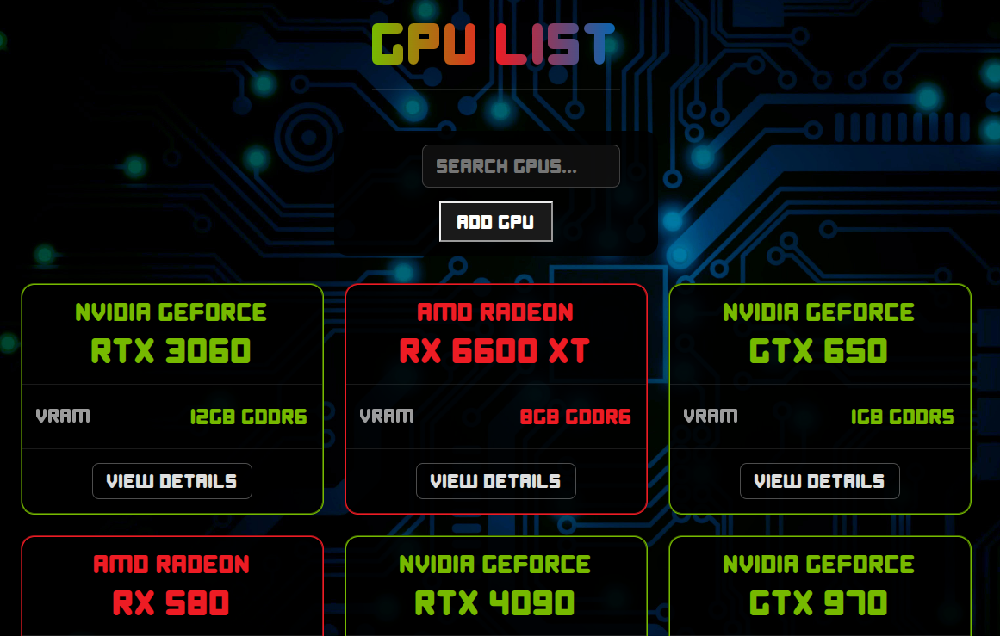

# GPU List
## Table of contents
  - [About](#about)
  - [Starting the web app](#starting-the-web-app)
    - [Frontend](#frontend)
    - [Backend](#backend)
  - [Navigating the UI](#navigating-the-ui)
    - [Main UI](#main-ui)
    - [Alternative UI](#alternative-ui)
  - [Performing CRUD operations via Backend](#performing-crud-operations-via-backend)
  - [Running the web app with Docker](#running-the-web-app-with-docker)
  - [End-to-End (E2E) testing](#end-to-end-e2e-testing)
    - [Manual testing](#manual-testing)
    - [Testing via Docker](#testing-via-docker)
  - [Backend server structure](#backend-server-structure)
  - [Troubleshooting](#troubleshooting)

## About
<<<<<<< HEAD
Single Page Application to store all of your graphics cards data, including the main chip specifications and clock speeds. 
=======
GPU List is a Single Page Application to store all of your graphics cards data, including the main chip specifications: Cores, TMUs, ROPs, VRAM, Bus Width and the clock speeds: Base Clock, Boost Clock, Memory Clock (Frequency). This web app is capable of automatically calculating the theoretical performance of any of your cards, including: FP32(float), Texture Rate, Pixel Rate and Memory Bandwidth. The frontend UI supports adding, deleting and searching for specific graphics cards. GPU List utilizes a MongoDB database to store its data, implementing a Mongoose+Express Node.js backend and an axios Vite+React frontend.
>>>>>>> bedcb970e18752223a6c120c0e80f156c78baa75

### Features
* Automatically calculates the theoretical performance of a graphics card: FP32(float), Texture Rate, Pixel Rate and Memory Bandwidth.

* Add, delete, search, and list GPUs through a simple frontend UI.

* Built with:
  - Database: MongoDB + Mongoose
  - Backend: Express
  - Frontend: React + Axios

### Screenshots
* Main UI

  

* Alternative UI (Beta)

  


## Prerequisites
* [Node.js](https://nodejs.org)↗ v18.20.5 or higher
* [npm](https://www.npmjs.com)↗ v10.8.2 or higher
* Internet connection to access the remote MongoDB database
* Optional: [Docker](https://www.docker.com)↗ v28.2.1


## Starting the web app
### Frontend
<<<<<<< HEAD
Main UI
=======
You only need to start one frontend at a time, if you wish to run both, follow the optional step below. Vite will automatically map each frontend to an available port, one will on port `:5173` and the other on `:5174`.

Navigate to the main UI folder and install the necessary dependencies
>>>>>>> bedcb970e18752223a6c120c0e80f156c78baa75
  ```
  cd ./gpulist/client && npm install
  npm run dev
  ```

Alternative UI (Optional)
  ```
  cd ./gpulist/alternate-client && npm install
  npm run dev
  ```

Vite auto-selects ports: 
  * Main UI → http://localhost:5173
  * Alternative UI → http://localhost:5174

### Backend
Development mode (hot reload with Nodemon)
  ```
  cd ./gpulist/server && npm install
  npm run dev
  ```

<<<<<<< HEAD
Production mode
  * Build frontend
=======
Start the backend
  * On dev mode, using nodemon for hot reloading
>>>>>>> bedcb970e18752223a6c120c0e80f156c78baa75
    ```
    Main UI
    cd ./gpulist/client && npm run build && cp -r ./dist ../server
    ```

<<<<<<< HEAD
  * Or Alternative UI
    ```
    cd ./gpulist/alternate-client && npm run build && cp -r ./dist ../server
    ```
=======
  * The production mode uses a static build of the frontend UI
    * Build the frontend
      ```
      Main UI
      cd ./gpulist/client && npm run build && cp -r ./dist ../server
>>>>>>> bedcb970e18752223a6c120c0e80f156c78baa75

  * Start the backend server
    ```
    npm run start
    ```

<<<<<<< HEAD
  * Access the frontend via the backend URL → http://localhost:3001
=======
      Alternative UI
      cd ./gpulist/alternate-client && npm run build && cp -r ./dist ../server
      ```

    * Start the server in production mode
      ```
      npm run start
      ```

    * The frontend will be accessible on the same address as the backend server http://localhost:3001
>>>>>>> bedcb970e18752223a6c120c0e80f156c78baa75


## Navigating the UI
### Main UI
#### Displaying a graphics card data
Click the `Show` button for a single card or `Show all data` for all cards.

#### Adding a new graphics card
<<<<<<< HEAD
Click the `Add Graphics Card` button → Fill all the required fields, none can be left empty.
=======
Click on the `Add Graphics Card` button and enter the following card data: Manufacturer, GPU Line, Model, Cores, TMUs, ROPs, VRAM (in GB), Bus Width (in bits), Memory Type, Base Clock (in MHz), Boost Clock (in Mhz), Memory Clock (in Gbps). All fields are mandatory and cannot be left empty. The placeholder values already have examples of what type of data format should be added in the form.
>>>>>>> bedcb970e18752223a6c120c0e80f156c78baa75

#### Using the search button
Click the `Search` button, search by manufacturer, GPU line or model (e.g., `rtx 40`).

#### Using the index
- Click the `Show index` button → a scrollable card list will be displayed.
- Clicking on a card → the page will scroll to the data table and expand it.
- Click on `Back to Index` button → The table collapses and returns you to the index.

#### Removing a graphics card
Expand the card table → on the bottom, click on the `Delete` → when prompted, click on confirm.

### Alternative UI
* Displaying a graphics card data → click the `View details` button.
* Adding a new graphics card → click on the `Add GPU` button, follow the same steps as the Main UI.
* Using the search button → on the `Search GPUs` bar, type the desired keywords.
* Removing a graphics card → same steps as the Main UI.


## Performing CRUD operations via Backend
Create
  ```
  POST http://localhost:3001/api/gpus
  ```


Body example
  ```
  {
    "manufacturer": "NVIDIA",
    "gpuline": "GeForce",
    "model": "RTX 5090",
    "cores": 21760,
    "tmus": 680,
    "rops": 176,
    "vram": 32,
    "bus": 512,
    "memtype": "GDDR7",
    "baseclock": 2017,
    "boostclock": 2407,
    "memclock": 28
  }
  ```

Read
  * Fetch all
    ```
    GET http://localhost:3001/api/gpus
    ```

  * Fetch one
    ```
    GET http://localhost:3001/api/gpus/:id
    ```

Update
  * You can update any number of fields
    ```
    PUT http://localhost:3001/api/gpus/:id
    ```

Delete
  ```
  DELETE http://localhost:3001/api/gpus/:id
  ```

## Running the web app with Docker
### Docker Compose
  ```
  cd ./gpulist
  docker-compose up -d
  ```

### Docker containers
Create a custom network
  ```
  docker network create gpulist_webapp-network
  ```

#### Building the images
Main UI
  ```
  docker build -t gpulist-webapp-client ./client
  ```

Alternative UI
  ```
  docker build -t gpulist-webapp-alt-client ./alternative-client
  ```

Backend
  ```
  docker build -t gpulist-webapp-server ./server
  ```

#### Running the containers
  * Main UI
    ```
    docker run -d --name gpulist-webapp-client --network gpulist_webapp-network -p 5173:80 gpulist-webapp-client
    ```
    
  * Alternative UI
    ```
    docker run -d --name gpulist-webapp-alt-client --network gpulist_webapp-network -p 5174:80 gpulist-webapp-alt-client
    ```

  * Backend Server
    ```
    docker run -d --env-file .env --name gpulist-webapp-server --network gpulist_webapp-network -p 3001:3001 -ti gpulist-webapp-server
    ```

#### Access
  * API → http://localhost:3001/api/gpus
	* Main UI → http://localhost:5173
	* Alternative UI → http://localhost:5174


<<<<<<< HEAD
## End-to-End (E2E) Testing
=======
## E2E Testing
To run End-to-End tests with Cypress, you can either run Cypress manually through a terminal, or by using Docker Compose to set a multi container orchestration for running the tests. The backend will connect to a test database in MongoDB.

`!Warning!` the E2E tests were designed to work with the Main UI only

>>>>>>> bedcb970e18752223a6c120c0e80f156c78baa75
### Manual testing
Enter the `tests` folder and install the dependencies
  ```
  cd ./tests && npm install
  ```

Start the Main UI
  ```
  cd ./client && npm run dev
  ```

Start the Backend Server in testing mode
  ```
  cd ./server && npm run start:test
  ```

Run Cypress
  * UI mode
    ```
    npm run cypress:open
    ```

  * CLI mode
    ```
    npm run cypress:cli
    ``` 
  
### Testing via Docker
  ```
  docker compose -f docker-compose.test.yml up --build --abort-on-container-exit
  ```

Note: ⚠️ E2E tests were designed for the Main UI only


## Backend server structure
### Folder overview
  ```
  gpuList-web-app/
  ├── index.js             # Entry point of the application
  ├── app.js               # Main Express app setup
  ├── dist/                # Compiled/production-ready files (if applicable)
  │   └── ...
  ├── controllers/         # Handles request logic (Controllers)
  │   └── gpus.js          # GPUs controller: handles API requests related to the GPUs
  ├── models/              # Data models/schema definitions (Models)
  │   └── gpu.js           # Defines the GPU schema/model
  ├── package-lock.json    # Manages exact dependency versions
  ├── package.json         # Project dependencies and scripts
  ├── utils/               # Utility/helper functions
  │   ├── config.js        # Handles environment configurations
  │   ├── logger.js        # Logger setup (for logging requests/errors)
  │   └── middleware.js    # Custom middleware (e.g., authentication, error handling)
  ```

### How Everything Works Together
* index.js – starts Express, imports app.js
* app.js – configures Express, middleware, routes
* controllers/gpus.js – handles GPU API requests
* models/gpu.js – Mongoose schema
* utils/config.js – environment configurations
* utils/logger.js – request/error logging
* utils/middleware.js – custom middleware (auth, error handling)


## Troubleshooting
* Frontend won’t start → Check the versions of Node.js ≥18 & npm ≥10
* Backend cannot connect to DB → Ensure .env file has the correct MongoDB URI
* Port already in use → Kill the process using the port or change the Vite/Express port in config
* Docker containers can’t communicate with each other → Verify the network `gpulist_webapp-network` exists
* E2E tests fail → Confirm the Main UI is running on http://localhost:5173