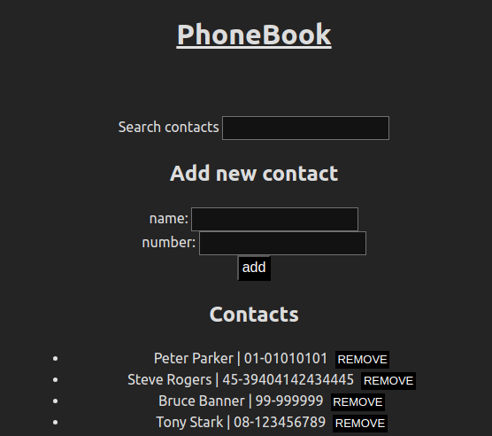

# PhoneBook
## Table of contents
  - [About](#about)
  - [Starting the web app](#starting-the-web-app)
    - [Frontend](#frontend)
    - [Backend](#backend)
  - [Navigating the UI](#navigating-the-ui)
    - [Adding a new contact](#adding-a-new-contact)
    - [Searching for a contact](#searching-for-a-contact)
    - [Removing a contact](#removing-a-contact)
  - [Performing CRUD operations on contacts through the backend server](#performing-crud-operations-on-contacts-through-the-backend-server)

## About
Single Page Application to store a contact's name and phone number. The frontend UI supports adding new contacts and removing them. This web app has no restrictions based on login, it is open for everyone accessing it. This web app uses a MongoDB database, implementing mongoose+express on the backend server and axios on the client side.




## Starting the web app
### Frontend
Navigate to the frontend folder and install the necessary dependencies
  ```
  cd ./phonebook/frontend && npm install
  ```

Start the frontend with
  ```
  npm run dev
  ```

### Backend
Navigate to the backend folder and install the necessary dependencies
  ```
  cd ./phonebook/backend && npm install
  ```

Start the backend with
  * On dev mode, using nodemon for hot reloading
    ```
    npm run dev
    ```

  * The production mode uses a static build of the frontend UI
    * First, build the frontend
      ```
      cd ./phonebook/frontend && npm run build && cp -r ./dist ../server
      ```

    * Then start the server in production mode
      ```
      npm run start
      ```

    * The frontend will be accessible on the same address as the server http://localhost:3001


## Navigating the UI
### Adding a new contact
To add a new contact to the PhoneBook, enter the contact's name and phone number on its respective fields and click the `add` button.

### Searching for a contact
The search bar input field will accept any keyword you want, matching the closest cases to it.

### Removing a contact
Click on the `remove` button to the right side of the contact you wish to remove.


## Performing CRUD operations on contacts through the backend server
Create
  ```
  POST http://localhost:3001/api/contacts name="Myself" number="00-0000"
  ```

Read
  * Fetch all
    ```
    GET http://localhost:3001/api/contacts
    ```

  * Fetch a specific id
    ```
    GET http://localhost:3001/api/contacts/:id
    ```

Update (only the phone number is allowed to be modified)
  ```
  PUT http://localhost:3001/api/contacts/:id number="<New number>"
  ```

Delete
  ```
  DELETE http://localhost:3001/api/contacts/:id
  ```

Info (Gives the total number of contacts present on the PhoneBook)
  ```
  GET http://localhost:3001/api/contacts/info
  ```
