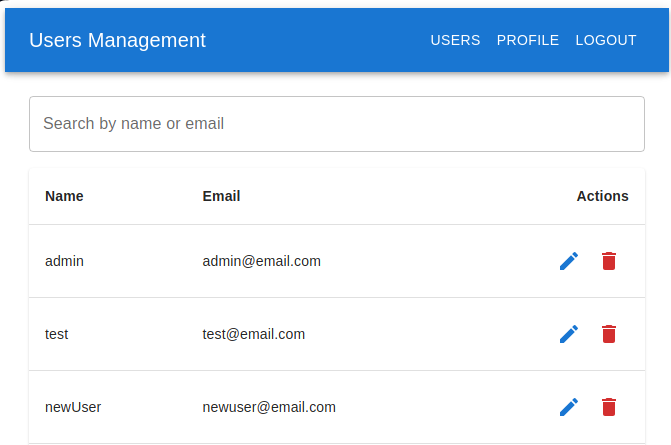

# User Management App
## Table of contents
  - [About](#about)
  - [Starting the web app](#starting-the-web-app)
    - [Frontend](#frontend)
    - [Backend](#backend)
  - [Navigating the UI](#navigating-the-ui)
    - [Register](#register)
    - [Login](#login)
    - [Editing a user's personal information](#editing-a-users-personal-information)
    - [Deleting users](#deleting-users)
    - [Profile page](#profile-page)
  - [Backend server routes and operations](#backend-server-routes-and-operations)


## About
Single Page Application to serve as a demonstration on how to build a web app to management a list of users, including registering, logging in, editing personal information and deleting users. The frontend was build using Material UI. All user's information are stored inside a MongoDB database.



## Starting the web app
### Frontend
Navigate to the frontend folder and install the necessary dependencies
  ```
  cd ./user-management-app/frontend && npm install
  ```

Start the frontend with
  ```
  npm run dev
  ```

### Backend
Navigate to the backend folder and install the necessary dependencies
  ```
  cd ./user-management-app/backend && npm install
  ```

Start the backend
  * On dev mode, using nodemon for hot reloading
    ```
    npm run dev
    ```

  * On production mode, using a static build of the frontend
    * First, build the frontend
      ```
      cd ./user-management-app/client && npm run build
      ```

    * Then start the server in production mode
      ```
      cd ../server && npm run start
      ```

    * The frontend will be accessible on the same address as the server http://localhost:5000
    

## Navigating the UI
### Register
To create a new account click on `Register` on the top blue navigation bar, you'll be sent to the Sign up screen, to input your name, email and password, press Enter or click on the `Register` button and the bottom, if your user is registered, you'll be redirected to the profile page.

### Login
On the login page, enter your email and password in their respective fields, then press Enter or click on the `Log in` button. Example credentials:
  ```
  Email: admin@email.com
  Password: admin
  ```

If you login successfully, you will be redirected to the users list.

### Editing a user's personal information
Access the users page on the top bar, click on the pencil icon on the right side of the user you wish to edit, you can change their name and email, passwords cannot be changed.

### Deleting users
On the users page, click on the red trash icon on the right side of the user, after prompted, click on `Ok` to confirm it.

### Profile page
The profile page will list your currently logged in user name and email.


## Backend server routes and operations
To make any HTTP requests to the backend /users api, an authorization token is required.

Register a new user
  ```
  POST http://localhost:5000/api/auth/register name="New user" email="newuser@email.com" password="newuser"
  ```

  * The response will contain your Authorization token

Fetch the list of users
  ```
  GET http://localhost:5000/api/users Authorization:"Bearer <Authorization token>"
  ```

Fetch your profile data
  ```
  GET http://localhost:5000/api/auth/profile Authorization:"Bearer <Authorization token>"
  ```

Login
  ```
  http POST http://localhost:5000/api/auth/login email="newuser@email.com" password="newuser"
  ```

  * The response will contain the Authorization token

Update a user's information (You can update the name, email or both through each request)
  ```
  PUT http://localhost:5000/api/users/:id Authorization:"Bearer <Authorization token>" name="New name"

  OR

  PUT http://localhost:5000/api/users/:id Authorization:"Bearer <Authorization token>" email="newemail@email.com"

  OR

  PUT http://localhost:5000/api/users/:id Authorization:"Bearer <Authorization token>" name="New name" email="newemail@email.com"
  ```

Delete a user
  ```
  DELETE http://localhost:5000/api/users/:id Authorization:"Bearer <Authorization token>"
  ```
